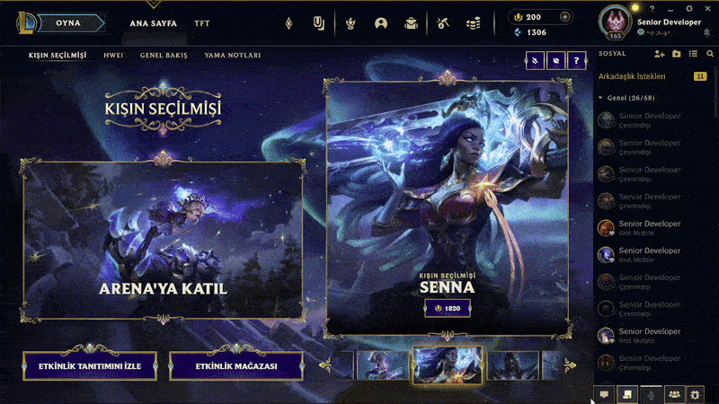

# League Client - Friends Button (Pengu Plugin)

## How to install
- Install [Pengu Loader](https://github.com/PenguLoader) first
- [Download latest release](https://github.com/ufukbakan/league-client-friends-button/releases/latest/download/friends-button.zip)
- Extract archive to pengu loader's plugins folder. (Generally: C:\Program Files\Pengu Loader\plugins)
- Activate pengu loader and restart client